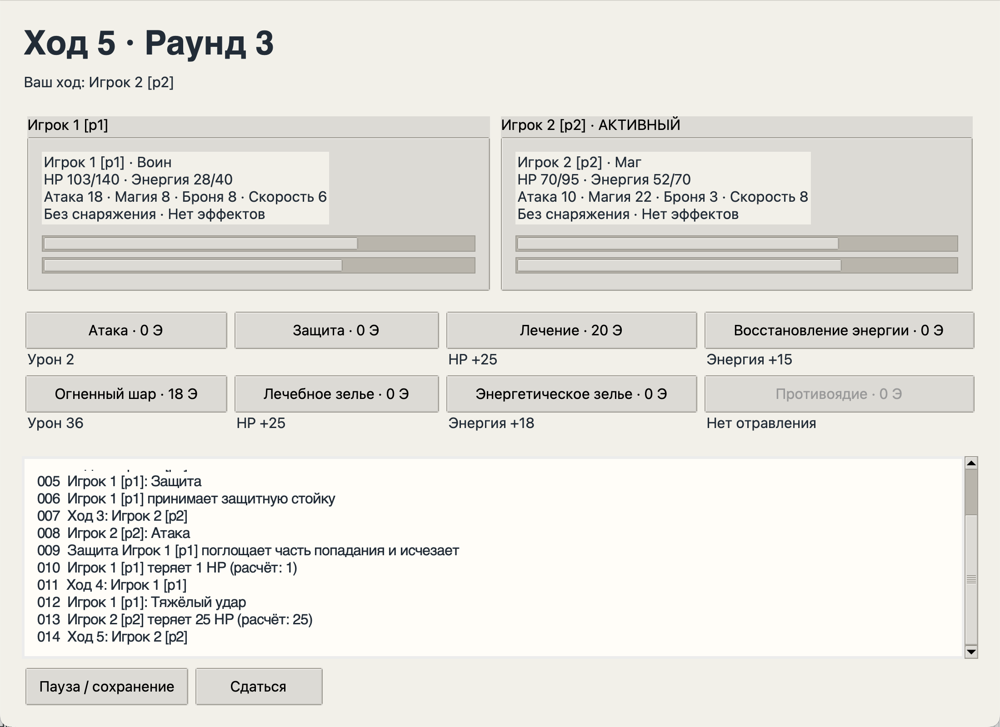

# Боевая арена

Локальная пошаговая игра на Python: воин, маг и следопыт; бой с другом или детерминированным ботом. Графический интерфейс Tkinter и консоль используют один игровой движок.



## Запуск

Нужен **Python 3.12 или новее**. У игры нет сторонних runtime-зависимостей и сетевых запросов.

```bash
git clone https://github.com/azazelioo/battle-arena-python.git
cd battle-arena-python
python3 -m arena
```

На Windows используйте `py -3.12 -m arena` или `python -m arena`. Консольный режим:

```bash
python3 -m arena --cli
```

Для окна нужен Python с Tcl/Tk. Проверка: `python3 -m tkinter`. В Linux может понадобиться пакет `python3-tk`, а для Python из Homebrew — соответствующий версии пакет `python-tk`. Если Tcl/Tk не установлен, консоль продолжает работать.

Сохранения по умолчанию находятся в `~/.battle-arena`. Для отдельного каталога:

```bash
python3 -m arena --data-dir ./local-data
```

Не добавляйте пользовательские сохранения в Git. Для разработки и проверки:

```bash
python3 -m venv .venv
# macOS / Linux
source .venv/bin/activate
# Windows PowerShell: .venv\Scripts\Activate.ps1
python -m pip install -e '.[dev]'
python -m pytest
python -m mypy arena
python -m pytest --cov=arena --cov-report=term-missing
```

Также предусмотрен `python -m arena --test`. На системе без графической среды GUI-тесты пропускаются с указанием причины. В CI окна проверяются под Xvfb.

## Что можно делать

- Выбрать архетип и снаряжение; увидеть итоговые характеристики до боя.
- Играть вдвоём или против агрессивного/осторожного бота.
- Атаковать, защищаться, лечиться, восстанавливать энергию, применять специальное действие и расходники.
- Поставить бой на паузу, сохранить в один из трёх слотов и продолжить тот же ход.
- Посмотреть журнал, результат и историю последних 50 матчей с фильтром.
- Изменить размер текста и задержку бота.

В консоли действия выбираются по номеру. `p` открывает паузу, `r` показывает правила, `q` предлагает сдаться. Недоступные действия объясняют причину отказа и не расходуют ход.

## Правила и архитектура

[Правила и формулы](docs/RULES.md) · [Архитектура и схема классов](docs/ARCHITECTURE.md) · [Сценарий защиты](docs/DEFENSE.md) · [Форматы файлов](docs/STORAGE.md) · [Результаты проверок](docs/VERIFICATION.md)

```text
arena/
  domain/          значения, персонажи, действия, эффекты, движок
  application/     контроллер и стратегии бота
  infrastructure/  JSON, атомарная запись, история, настройки
  presentation/    Tkinter, консоль, русскоязычное форматирование
  __main__.py      выбор режима запуска
tests/             правила, сохранения, ошибки, интерфейсы
tools/             измерение времени, памяти и числа строк
docs/              правила, архитектура и фактические отчёты
```

Ключевая точка входа в правила — `BattleEngine.submit(ActionRequest)`. В запросе есть идентификатор матча и ожидаемый номер хода. Действия вызываются через общий контракт `Action`, а интерфейсы и бот получают неизменяемые снимки.

## Соответствие ТЗ

Реализованы игровые сценарии, GUI/CLI, сохранения, история, две стратегии и автоматические проверки. Контрольная последовательность из Word проверяется в `test_six_turn_reference_example`; сохранение отравленного бойца — в `test_poison_save_does_not_tick_again`.

**Ограничение объёма:** реализация компактнее планового коридора 6500–7500 содержательных строк из ТЗ. Фактический подсчёт опубликован в [line-count.json](docs/line-count.json). Соответствие этому учебному критерию и допустимость адаптации требований C++ к Python нужно согласовать отдельно. Процент покрытия и выполненные проверки приведены без округления до «полностью проверено» в отчёте.

Проект создан с помощью ИИ. Если в правилах курса есть ограничения на генерацию кода, учитывайте их при использовании и защите. `typing.override`, `typing.final`, `with` и `frozen=True` не являются буквальными аналогами механизмов C++.

## Измерения

```bash
python tools/count_lines.py
python tools/benchmark.py
```

Счётчик отдельно показывает физические, непустые, документирующие и кодовые строки. Бенчмарк измеряет 1000 команд и память серии из 100 матчей; результаты зависят от компьютера. `tracemalloc` не измеряет память Tcl/Tk и всего процесса.

## Права

Отдельная лицензия на распространение и переработку пока не выбрана владельцем. Сторонние изображения, музыка и игровые ассеты не используются.
