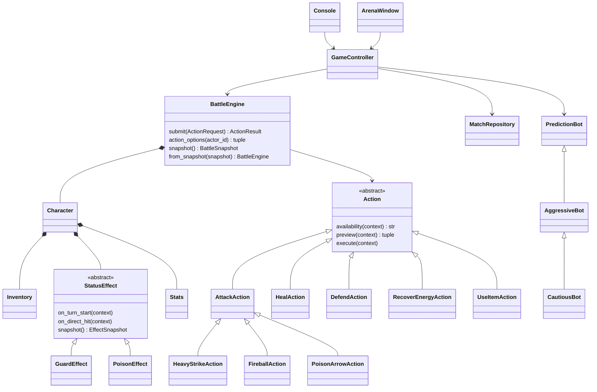

# Архитектура

## Слои

Домен не использует input, print, Tkinter и файловые операции. Контроллер управляет режимом, паузой и сохранениями. Инфраструктура проверяет и записывает JSON. Представления форматируют снимки и отправляют запросы.

Каталог баланса находится в домене: это чистые неизменяемые определения, а не чтение внешнего файла. Это небольшое осознанное отличие от рекомендуемого размещения каталога в инфраструктуре.

## Путь команды

1. Кнопка запоминает ActionRequest текущего снимка. Консоль создаёт такой же запрос.
2. GameController проверяет паузу и владельца ввода: человек или бот.
3. BattleEngine проверяет match_id, expected_turn, активного бойца, доступность действия и цель.
4. Action.availability проверяет ресурсы без изменений состояния.
5. Движок оплачивает энергию и полиморфно вызывает Action.execute.
6. Действие меняет Character через ограничивающие методы и записывает события.
7. Движок проверяет победу, лимит действий и начало следующего хода.
8. Представление получает новый неизменяемый снимок.

Проверки ожидаемых отказов выполняются до изменения состояния. Неожиданные программные ошибки не маскируются как успешная команда. Это не транзакционная база с rollback произвольного испорченного расширения Action.

## Механизмы ООП

| Механизм | Работающее применение |
|---|---|
| Инкапсуляция | Character ограничивает HP/энергию; свойства только для чтения |
| Абстракция | ABC-контракты Action, StatusEffect, PredictionBot |
| Наследование | Атаки, эффекты и стратегии переопределяют поведение |
| Полиморфизм | execute, on_turn_start, choose_action |
| Композиция | Один Character объединяет архетип, Stats, Inventory и эффекты |
| Оператор + | Stats + StatBonus используется и предпросмотром, и созданием |
| Специальные методы | History поддерживает len, индекс, срез и итерацию |
| Generic / overload | History[T], разные типы результатов индекса и среза |
| override / final | Проверяются mypy; не обеспечивают runtime-запреты |
| Ресурсы | with для файлов, атомарная замена, отмена after при навигации |

History возвращает копию при срезе. Stats и снимки frozen, вложенные коллекции представлены кортежами. Снимок не содержит живого словаря предметов или виджета.

## Сохранение и восстановление

BattleEngine.from_snapshot не вызывает обычный конструктор: новый бой запускает начало хода, а загруженный уже его прошёл. Восстановление создаёт новые Character, Inventory и эффекты; изменяемые объекты с исходной игрой не разделяются.

GUI отменяет ожидающий callback при паузе, смене экрана, загрузке и закрытии. Callback дополнительно проверяет матч и ход. Задержка реализована через after, без sleep в обработчике.

## Границы аналогии с C++

Python не реализует const-корректность или виртуальный деструктор в смысле C++. frozen защищает присваивание полям, но не превращает любой вложенный объект в неизменяемый. overload описывает типы, а не создаёт несколько реализаций функции. with закрывает ресурс независимо от сборщика мусора. Эти отличия надо объяснить на защите.

## Навигация и просмотр истории

HistoryBrowser использует индекс и срез History в GUI и CLI, фильтрует результаты и считает статистику. BattleReplay восстанавливает HP и энергию из записанных фактических изменений и стоимости действий; он не исполняет команды повторно. ScrollViewport обеспечивает прокрутку при большом шрифте и показывает виджет, получивший фокус.
